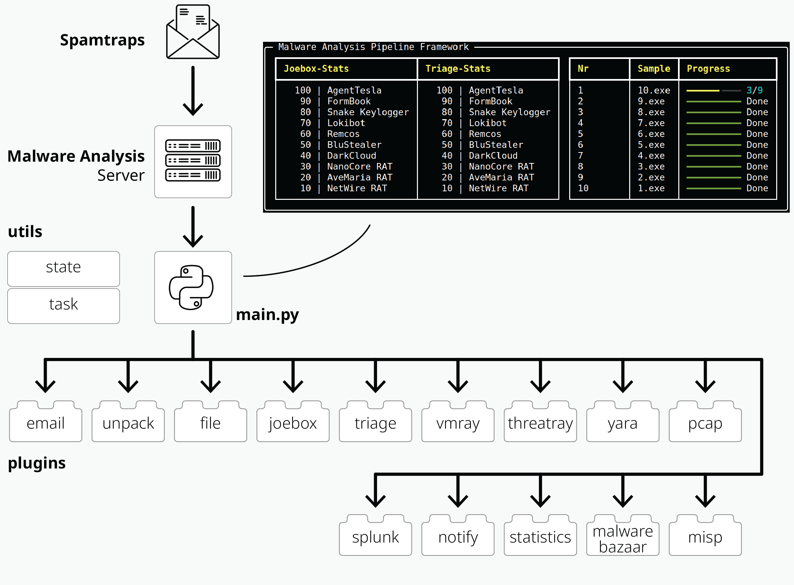

# Lightweight Python-Based Malware Analysis Pipeline

Sharing threat information through Indicators of Compromise (IOC), Tactics, Techniques, and Procedures (TTP) used by threat actors improves cyber security by actively protecting and monitoring an organization's network. The well-known Malware Information Sharing Platform (MISP, 2022), initially developed by the Belgian CERT and NATO CERT, is the ultimate platform to share such information throughout the cyber security community. To generate new IOCs, companies need to have an automated way to analyze suspicious binaries, generate high-value indicators and share them.

LPMAP provides a self-developed Malware Analysis Pipeline tool to analyze potentially malicious email attachments automatically. The attachments run through a plugin-based Python Malware Analysis Pipeline and are sent to various sandboxes. All the information gained by the sandboxes and their reports is then shared in the MISP. Furthermore, all binaries are shared on the free malware-sharing platform MalwareBazaar.abuse.ch.

## Architecture


## Installation

Requirements: Python 3.10
OS: Tested on Ubuntu 22.04

```
sudo mkdir /data 
sudo chown XY:XY /data
sudo chmod -R 750 /data
mkdir /data/stats /data/emails /data/analysis /data/suricata /data/suricata/rules /data/suricata/logs /data/yara /data/logs
cd /data
sudo apt install redis-server yara p7zip-full git
sudo apt-get install software-properties-common
sudo add-apt-repository ppa:oisf/suricata-stable
sudo apt-get update
sudo apt-get install suricata
wget -O /tmp/etpro.rules.tar.gz https://rules.emergingthreats.net/open/suricata-7.0.2/emerging.rules.tar.gz; tar -C /data/suricata/ --overwrite -xf /tmp/etpro.rules.tar.gz
wget -O /data/suricata/rules/urlhaus.rules https://urlhaus.abuse.ch/downloads/suricata-ids/
wget -O /data/suricata/rules/feodotracker.rules https://feodotracker.abuse.ch/downloads/feodotracker.rules
wget -O /data/suricata/rules/sslbl.rules https://sslbl.abuse.ch/blacklist/sslblacklist_tls_cert.rules
wget -O /tmp/malpedia.zip https://malpedia.caad.fkie.fraunhofer.de/api/get/yara/tlp_green/zip; 7z x -aoa -o/data/yara/ /tmp/malpedia.zip

git clone https://github.com/threatcat-ch/malware-analysis-pipeline.git
cd malware-analysis-pipeline
pip install pipenv --user
# Maybe define the Linux env PATH variable ($HOME/.profile)
pipenv shell
pipenv install
```

## How to start the tools

* main.py
```
pipenv run python main.py
```

* Python Rich Malware Analysis Pipeline Framework (PRMAPF)
```
pipenv run python prmapf.py
```

## Documentation
https://www.sans.org/white-papers/lightweight-python-based-malware-analysis-pipeline/

## Demo
https://youtu.be/ZOQHtNP27mQ
